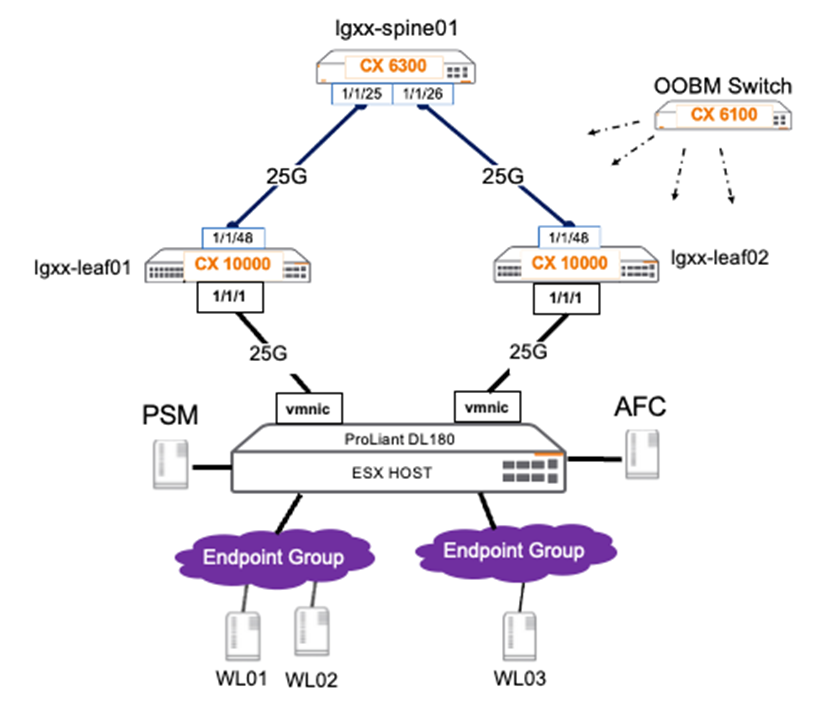
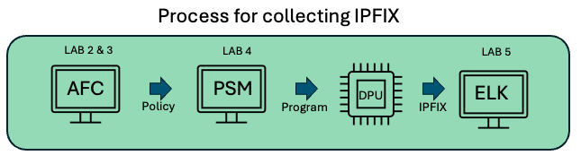

# Lab 1 - Accessing the Lab

## Lab Overview

Lab time:  15 minutes

In this workshop, we are going to explore the environment and access the various components of the lab.  The lab consists of the following hardware:
- 1x CX 6300 Switch which acts as the Spine 
- 2x CX 10000 Switches configured as Leaf Switches
- 1x ProLiant Server running ESXi and connected to both Leaf Switches  

_Fig. Lab Physical Layout_  

## Lab 1.1 Management IP Addresses

The following table represents the Management IP Addresses we will use to access each of the different components within the labs:  

| DEVICE    | INTERFACE | IP ADDRESS  |  
| -------- | ------- | ------- |
| Aruba Fabric Composer (AFC) | Managment | 10.250.2**[LG]**.30 |
| Pensando PSM | Managment | 10.250.2**[LG]**.31 |
| LGXX-spine01 | Managment | 10.250.2**[LG]**.103 |
| LGXX-leaf01 | Managment | 10.250.2**[LG]**.101 |
| LGXX-leaf02 | Managment | 10.250.2**[LG]**.102 |
| Workload-01 | Managment | 10.250.2**[LG]**.201 |
| Workload-02 | Managment | 10.250.2**[LG]**.202 |
| Workload-03 | Managment | 10.250.2**[LG]**.203 |

## 1.2 Lab Software Versions  
| DEVICE    | SOFTWARE VERSION |  
| -------- | ------- |  
| Aruba Fabric Composer (AFC) | 7.01 |  
| Policy Services Manager | 1.80.1-T-6 |  
| CX Switches | DL 10.13.1010 |  
 

There are three (3) virtual machines (VMs) being used for this workshop that will serve as our Endpoints; **LGXX-WL01, LGXX-WL02 and LGXX-WL03**. These workloads are Ubuntu Linux VM’s The **XX** will be replaced with the _Lab Group number_ that was assigned at the start of this workshop.  

These workload VMs are tagged in vSphere and will be leveraged for Rule and Policy mapping.  

For more information on Data Center deployment check out the Aruba Validated Solutions Guide’s (VSG) VMware vSphere section located here:  

https://www.arubanetworks.com/techdocs/VSG/docs/050-dc-deploy/esp-dc-deploy-120-fabric-deploy/#vmware-vsphere-integration  

- See also AFC User Guide (Version 6.5 used for this workshop): 
https://www.arubanetworks.com/techdocs/AFC/PDFs/64/AFC64UG.pdf

### IPv4 Address Pool  
As the Aruba Fabric Composer relies on automation to deploy the data center infrastructure, an IPv4 address pool has been created and ready to use. (**10.100.0.0/24**)  

### MAC address pool
As the Aruba Fabric Composer relies on automation to deploy the data center infrastructure, a MAC address pool has been created. This is just a pool of address that AFC can use to assign MAC addresses when required. (**02:00:00:00:00:aa-02:00:00:00:00:ff**)

## 1.3 Telemetry flow 

In the HPE Arubas CX10K swicth there are two Data Processing Units (DPU). The process to send IPFIX and firewall logs to the ELKstack is depicted in the following diagram.

_Fig. Basic flow diagram_  

The process is as follows:

1.  in LAB 2 & 3, you will integrate PSM into the AFC and define a policy to send all traffic to the DPU chips.

2. In LAB 4, you will log into the PSM and verify that is has the CX10K switches admitted and the DPU's are operational.

3. In LAB 5, you will use Elastic Search to visualize the IPFIX flow information.

