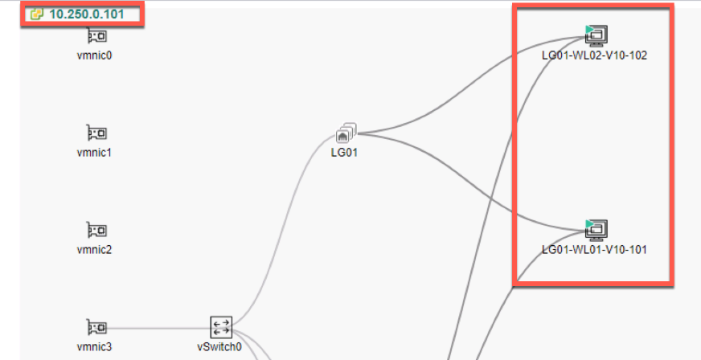

# Lab 2 - AFC Configuration  

## Lab Overview
Lab time:  45 minutes  

The workshop is configured with two HPE Aruba CX10000 (CX10K) distrubted Services switches.

  
_Fig. Accessing the AFC_  

```{note}
VSX Configuration is being skipped in this workshop due to limited hardware availability, but it is always recommended to configure a high-availability setup for critical server workloads. Refer to our Validated Solutions Guide (VSG) to learn more:  

https://www.arubanetworks.com/techdocs/VSG/docs/050-dc-deploy/esp-dc-deploy-120-fabric-deploy/#configure-vsx-on-leaf-switches
```  

You were _assigned a pod number_ at the start of the workshop. Add a zero in front of it and it becomes the _lab group number_. In the third octet of the IP address, start with the number 2 and add your lab group number to it. As an example, user1 = lab group 01 – 3rd octet, 201. The AFC IP for lab group 01 would be 10.250.201.30

## Lab 2.1 - Logging into the AFC 

### Description  
In this workflow the Aruba Fabric Composer (AFC) will automate configuring the routed interfaces and assigning IP addresses.  Once complete, the network will be ready to deploy the Underlay network.  

### Validate  
1. Open a new browser tab/window and log into the HPE Aruba Networking Fabric Composer (AFC).  Use the following URL and credentials to access the AFC.

|||
|---|---|
|URL|``https://10.250.2LG.30`` where **LG = your Lab Group Number**|
|Username|``admin``|
|Password|``admin``|  

  
_Fig. AFC Login_  

2. Once logged in, we will integrate **Vcenter and the Pensando PSM into the AFC** follow the steps below to complete the integration.

```{note}
If the workflows on the right-hand side are not present, click on the icon next to the person at the top right
```  

  
_Fig. Accessing the AFC_  


## Lab 2.2 - Integrate vSphere

### Description
Using the AFC we will add an integration with VMware vSphere.  This integration provides ...

### Validate
1. Open the AFC, click the **Configuration** menu, and select **Integrations** > **VMware vSphere**

  
_Fig. Lab 4 Integrations Menu_  

2. Using the **ACTIONS** menu, select **Add**.

  
_Fig. Lab 4 Add Integration_  

3. Add the vSphere integration by entering the following information in the form:  

|   |   |
|---|---|
|**Step 1 - Host**|  |
| Name | dsf-vsphere |
| Description | vSphere Cluster |
| Host | ``10.250.0.50`` |  
| Username | ``lg[LG]@vsphere.local`` |  
| Password | ``Aruba123!@#`` |  
| ***Click VALIDATE and NEXT***||

|   |   |
|---|---|
|**Step 2 - Aruba Fabric**|  |
| Automate VLAN provisioning for ESX hosts directly connected to the fabric | YES |
| Automate VLAN provisioning for ESX hosts connected through intermediate ... | NO |
| Automated PVLAN provisioning for ESX hosts directly connected to the fabric ... | YES |  
| Automated Endpoint Group Provisioning * | YES |  
| ***Click NEXT***||

|   |   |
|---|---|
|**Step 3 - vSphere**|  |
| Discovery Protocols | YES |
| ***Click NEXT***||

|   |   |
|---|---|
|**Step 4 - Summary**|  |
| Review the summary and then ***Click APPLY***||


### Expected Results

Verify that the integration is successfully connected as shown in the following screenshot.  

  
_Fig. Lab 2 Connected vSphere_   


## Lab 2.3 - AFC Host Visualization

### Description  
Once vSphere is integrated with AFC, AFC will use RESTful APIs to poll vSphere to gather an inventory of hosts, VMs, Networks, etc.  We will explore the AFC Host Visualization in this lab.

### Validate  
1. Open the AFC, click the **Visualization** menu, and select **Hosts**

  
_Fig. Lab 2 Visualizations Menu_  

2. At the bottom of the page go to the **VM** list (Click VMS) find and select your lab-groups workload servers. **LG[LG]WL01-v10-101** and **LG[LG]-WL02-v10-102**.  

```{note}
You may have to expand the lower part of the screen to access this list.  In this example, LG01 VM's are selected.
```

  
_Fig. Lab 2 VM Workload List_  

```{note}
AFC Host Visualization defaults to Lab Group 01. Be sure to select your lab to see your diagram. Your lab will be 10.250.0.1**LG**, where **LG** is your Lab Group Number.  You may have to expand the lower part of the screen to access the list.  *LG01 VM's are selected in this example*  
```

  
_Fig. Lab 2 Host Visualization_  


### Expected Results  

Verify that the host address matches the one connected to your switches. Use the following table as reference.


| Lab Group | vSphere Host | Lab Group | vSphere Host | 
|---|---| ---|---|
| 01 | 10.250.0.101 | 06 | 10.250.0.106 |
| 02 | 10.250.0.102 | 07 | 10.250.0.107 |
| 03 | 10.250.0.103 | 08 | 10.250.0.108 |
| 04 | 10.250.0.104 | 09 | 10.250.0.109 |
| 05 | 10.250.0.105 | 10 | 10.250.0.110 |

```{note} 
Verify you see the physical connections to your leaf group. If you do not see the connections, the ports may be down on the switches. You can use show interface brief on the command line of the switch and look for port 1/1/1 on each switch.  
```

## Lab 4.3 - Integrate PSM 

### Description
Using the AFC we will now add an integration with the AMD Pensando Policy and Services Manager (PSM).  PSM provides centralized management and visibility of all stateful services running in the infrastructure.  AFC acts as an abstraction layer for some of the PSM stateful functions.

### Validate
1. Open the AFC, click the **Configuration** menu, and select **Integrations** > **Pensando PSM**

  
_Fig. Lab 2 Integrations Menu_  

2. Use the **ACTIONS** menu to select **Add**  

  
_Fig. Lab 2 Add Integration_  

3. Add the Pensando PSM Integration by entering the following information in the form:  

|   |   |
|---|---|
|**Step 1 - Host**|  |
| Name | dsf-psm |
| Description | Policy and Services Manager |
| Host | ``10.250.2[LG].31`` - where **LG** is your labgroup number |  
| Username | ``admin`` |  
| Password | ``Pensando0$`` (Pensando + zero + dollar)|  
| ***Click VALIDATE and NEXT***||

|   |   |
|---|---|
|**Step 2 - Settings**|  |
| Fabric | dsf |
| Enable auto decommissioning for switches deleted from the system | YES |
| Enable auto VLAN placement on all switches when creating a Network | YES |  
| VMware vCenters | Select the vSphere server |  
| ***NEXT***||

|   |   |
|---|---|
|**Step 4 - Summary**|  |
| Review the summary and then ***Click APPLY***||  

### Expected Results

Verify that the integration is successfully connected and **HEALTHY** as shown in the following screenshot.  

  
_Fig. Lab 2 Connected PSM_   

```{note}
If the health is not green, wait a few moments and refresh the page.  
```

## Lab 2.4 - Access PSM 

### Description  
We will log into the PSM to verify that the the AFC integration was successful.  AFC should have added the two CX 10000 Switches (also called Distributed Services Switch or DSS) to the PSM.

### Validate
Using the web browser in your RDP client, open the PSM using the following URL and credentials:  

**URL:**  https://10.250.2LG.31  
**Username:**  ``admin``  
**Password:**  ``Pensando0$``  

  
_Fig. Lab 2 PSM Login_   

### Expected Results
Once logged into the PSM, navigate to **System** > **DSS** and verify that the CX 10000 Switches are in the healthy state.

  
_Fig. Lab 2 DSS Overview_   

## Lab 2 Summary

- During this lab, we added third party integrations to the Aruba Fabric Composer  
- We added an integration to vSphere from AFC
  - We verified the integration, by using the Host Visualization feature in the AFC
- We added an integration with the AMD Policy and Services Manager  
- We accessed the PSM to verify that the integration was successful and that both CX 10000 switches were added by AFC to PSM  

## Lab 2 Learning Check

|   |   |
|---|---|
| 1 | Wehn adding the Vcenter server, you get visibility into the Virtual Network. |
| 2 | Learning Check|
| 3 | Learning Check |  
| 4 | Learning Check |  
| 5 | Learning Check | 


### Build a rule
### Assign Rule to Policy
### Build End point groups
### Explore AFC 
